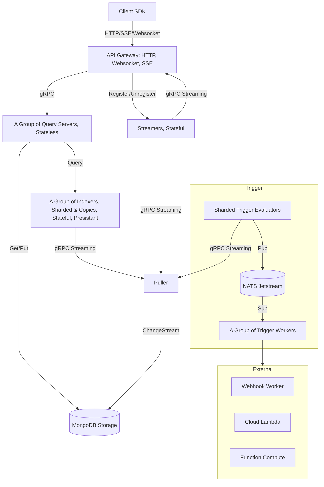

# Design Documents

Designs are organized by [server](server/), [SDK](sdk/), and
[monitoring](monitor/). Their status distinguishes proposals from implemented
mechanisms; the diagram below is the service design overview.

## Writing and Decision Ownership

Describe component responsibilities, contracts, data flows, and failure behavior.
Explain Why alongside How so a reader can assess the mechanism. Detailed
alternatives, trade-offs, and historical decisions belong in an
[Agent Note](../../.agents/notes/README.md), linked from the relevant discussion.

Keep affected designs synchronized with implementation in the same change.
Rewrite documents coherently and reconcile conflicting statements.
Execution plans remain in `docs/plans/`, and the [task board](../tasks/BOARD.md)
tracks work. Use [prose-standard](../../.agents/skills/prose-standard/SKILL.md)
when editing prose and preserve the complete behavior being described.

## Architecture Overview

