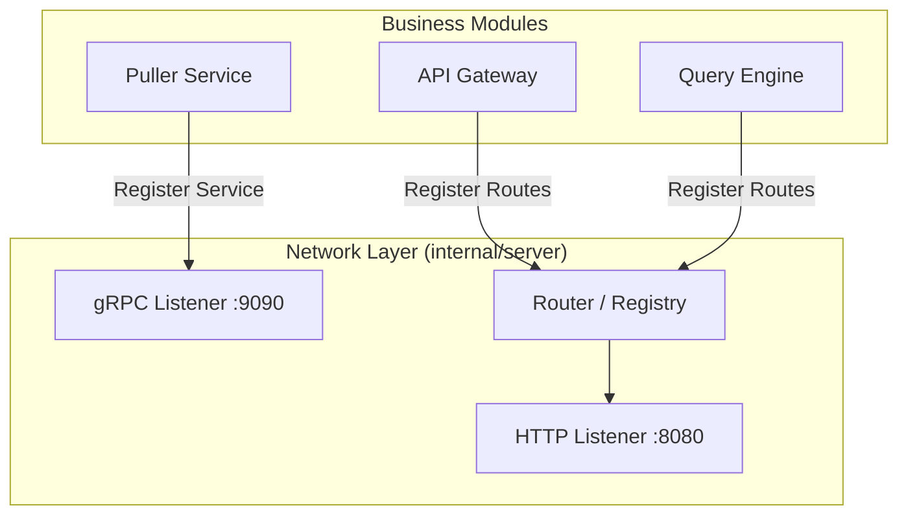

# Unified Server Module Architecture

**Date:** January 3, 2026
**Status:** Draft

## 1. Overview

The `internal/server` module acts as the centralized **Network Layer** for the Syntrix application. Instead of each module (API, Puller, Engine) creating and managing its own HTTP/gRPC servers, they **register** their handlers and services with this unified module.

This "Inversion of Control" pattern provides:
- **Port Consolidation**: Multiple modules can share the same port (e.g., API and Realtime on port 8080).
- **Unified Configuration**: Security, timeouts, and observability are configured once and applied globally.
- **Simplified Lifecycle**: The Service Manager only needs to start/stop the central Server Service.

## 2. Architectural Pattern: Centralized Registration

### 2.1 The Problem (Current State)
Currently, Syntrix uses a **Distributed Creation** pattern:
- `API Gateway` creates an `http.Server`.
- `Puller` creates a `grpc.Server`.
- `Query Engine` creates another `http.Server`.

This leads to:
- **Inconsistent Configuration**: Different timeouts and security settings across services.
- **Port Sprawl**: Harder to manage firewall rules and container mappings.
- **Observability Gaps**: Middleware must be manually applied to each server.

### 2.2 The Solution (Proposed State)
We propose a **Centralized Registration** pattern:
1.  **The Container**: `internal/server` creates and manages the listening sockets (HTTP & gRPC).
2.  **The Registrants**: Business modules (`api`, `puller`) are initialized *without* starting any servers.
3.  **The Binding**: The Service Manager injects the `server.Service` into business modules (or vice versa), and they register their routes/services.



## 3. Core Concepts

### 3.1 The Service Interface
The module exposes a high-level `Service` interface that abstracts the underlying `net/http` and `google.golang.org/grpc` implementations. This allows for:
- **Testability**: We can mock the server for integration tests.
- **Encapsulation**: Implementation details (like graceful shutdown logic) are hidden.

### 3.2 Middleware Strategy
The architecture enforces a **Layered Middleware** approach:

1.  **Global Layer (internal/server)**: Applied to ALL requests.
    - Panic Recovery
    - Request ID / Tracing
    - Structured Logging
    - Global CORS
2.  **Module Layer (Business Modules)**: Applied to specific routes.
    - Authentication / Authorization
    - Input Validation
    - Rate Limiting (specific to endpoints)

## 4. Integration Workflow

1.  **Initialization**: The `Manager` initializes the `server.Service`.
2.  **Registration**: Business modules register their handlers.
3.  **Startup**: The `Manager` calls `server.Start()`, which opens the ports.
4.  **Shutdown**: The `Manager` calls `server.Stop()`, which drains connections and closes ports.

## 5. Package Structure

```text
internal/server/
├── config.go           # Configuration definitions
├── interface.go        # Public interface for registration & lifecycle
├── service.go          # Main implementation (The "Container")
├── http_server.go      # Internal HTTP server wrapper
├── grpc_server.go      # Internal gRPC server wrapper
└── middleware.go       # Standard middleware chains
```
